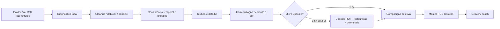

# Fase 7 — plano do Reconstruction Finisher

Data: 12/09/2026  
Estado: **PLANO — IMPLEMENTAÇÃO NÃO INICIADA**

## Objetivo e invariantes

O Reconstruction Finisher deverá aproximar a naturalidade visual do Cleaner de
referências comerciais como VMake usando arquitetura própria e componentes com
licença verificada. Ele atua somente dentro da região reconstruída e em um halo
interno controlado. Pixels fora da seleção continuam vindo do vídeo original.

Invariantes:

1. `CLEANER_GOLDEN_V4` permanece congelado e reproduzível.
2. Enhancement global nunca é automático.
3. Cada estágio pode ser desligado e comparado isoladamente.
4. Master lossless precede qualquer delivery polish.
5. Nenhum modelo, código ou algoritmo proprietário é inferido ou copiado do VMake.
6. Mudança que falhar preservação externa, geometria, áudio ou estabilidade é rejeitada.

## Arquitetura proposta

O diagnóstico local calcula ruído, blocagem, blur, discrepância de luma/croma,
energia de borda, textura e erro temporal contra anéis válidos do entorno. Ele
habilita apenas operações justificadas e registra decisão e intensidade.

## Estágios candidatos

| Ordem | Estágio | Escopo e gate |
|---:|---|---|
| 1 | artifact cleanup | remover resíduos pequenos sem apagar estrutura real |
| 2 | deblocking | somente quando detector confirmar blocagem local |
| 3 | mild denoise | força limitada pelo ruído do entorno |
| 4 | ghosting reduction | requer evidência temporal e proteção de movimento real |
| 5 | temporal consistency | flow/warping com cortes e oclusões explícitos |
| 6 | texture harmonization | casar estatística local sem inventar padrão repetido |
| 7 | detail recovery | recuperar bordas plausíveis com teto de oversharpen |
| 8 | edge/seam harmonization | halo interno; zero alteração fora da seleção |
| 9 | local deblur | apenas ROI com blur medido; sem alterar rosto/objeto fora dela |
| 10 | grain/noise matching | estimar no anel do source e sintetizar temporalmente estável |
| 11–15 | brilho, contraste, saturação, white balance, micro-upscale | ajustes locais com limites e ablações |
| 16 | high-quality downscale | filtro fixo e teste contra aliasing/ringing |
| 17 | delivery polish | um encode comum depois do master, nunca usado para esconder defeito |

## Experimento de micro-upscale

Braços congelados para a mesma entrada, máscara e reconstrução Golden V4:

- U10: 1,0×, sem upscale;
- U15: 1,5× ROI → restauração → downscale;
- U20: 2,0× ROI → restauração → downscale.

Comparar naturalidade, textura, sharpness, aliasing, ringing, consistência temporal,
artefatos, tempo, VRAM e custo. O upscale só é promovido se vencer visualmente no
teste cego e não aumentar flicker, borda artificial ou estrutura inventada. Modelos
de super-resolution de imagem isolada não entram automaticamente em vídeo.

## Análise da referência VMake

VMake será referência visual externa, nunca ground truth. Para os mesmos frames,
medir e revisar:

- sharpness e perfil de borda;
- luma, contraste, saturação e white balance;
- espectro de ruído/grão;
- textura e detalhe aparente;
- estabilidade temporal, flicker e ghosting;
- transição entre reconstrução e contexto.

As conclusões descrevem propriedades observáveis. Qualquer afirmação sobre engine,
modelo ou pipeline interno do VMake fica `UNKNOWN` sem fonte verificável.

## Presets futuros

| Preset | Contrato proposto |
|---|---|
| Cleaner | Golden V4 praticamente puro; menor latência e risco |
| Quality | Golden V4 + Finisher moderado e diagnosticado |
| Studio/Max | Golden V4 + Finisher completo + micro-upscale aprovado + polish temporal e de delivery |

Os nomes são proposta de produto. Nenhum preset será ligado antes do benchmark.

## Protocolo experimental

1. Criar controles sintéticos com ground truth para blocagem, ruído, blur, seam,
   ghosting e variação de cor.
2. Reutilizar os casos difíceis da Fase 6 e adicionar holdout independente.
3. Congelar input, máscara, master Golden V4, FPS, frames e conversão de cor.
4. Avaliar um estágio por vez contra Golden V4 e um braço identity.
5. Executar ablação cumulativa somente após cada estágio passar isoladamente.
6. Fazer review cego antes de revelar o braço.
7. Promover apenas ganhos repetidos por categoria; registrar derrotas e empates.

Métricas mínimas: alteração externa exata no master, boundary step, SSIM/PSNR fora
da máscara contra controle de encode, LPIPS quando houver GT, textura, gradiente,
aliasing/ringing, diferença de luma/croma, ruído, fluxo temporal, flicker, ghosting,
tempo por frame, RAM/VRAM e custo.

## Gates de promoção

- zero pixels alterados fora da seleção no master;
- frame count, PTS, FPS, geometria e áudio preservados;
- nenhuma regressão grave de flicker, ghosting ou seam;
- preferência cega e ganho mensurável em mais de um caso por categoria;
- custo e latência compatíveis com o preset;
- licença e dependências aprovadas para o uso pretendido;
- fallback simples para Golden V4 quando diagnóstico ou estágio falhar.

## Ordem de implementação futura

1. harness e diagnósticos, sem alterar produção;
2. harmonização de seam/cor e grain matching clássicos;
3. cleanup/deblock/denoise leves;
4. consistência temporal e ghosting;
5. detalhe/deblur;
6. micro-upscale 1,5×/2,0×;
7. integração dos presets e observabilidade;
8. rollout controlado com rollback para Golden V4.

Esta fase só começa após aprovação explícita do plano. Até lá, nenhum estágio do
Finisher e nenhum enhancement global deve entrar no pipeline.
