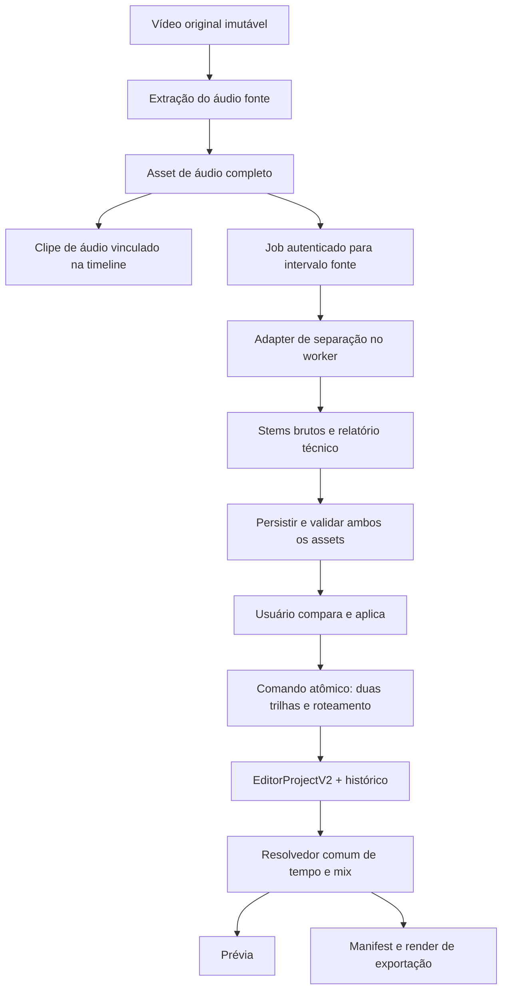

# Editor V2 — áudio extraído, diálogo e música

Data da auditoria: 14/09/2026. Estado: **AUD-00_TECHNICAL_HARNESS_READY / AUD-01_BROWSER_SMOKE_PASS / AUD-02_PERSISTENCE_RELINK_BROWSER_PASS / AUD-03_B0_B2_RUNTIME_PASS / AUD-04_B2_LEADS_CONTROLLED_TTS_AND_HUMAN_READ_SPEECH / AUD-05_REMOTE_WORKER_SMOKE_PASS_MIGRATION_READY / AUD-06_CLIENT_FLOW_IMPLEMENTED_BROWSER_REGRESSION_PASS / AUD-07_BROWSER_MP4_EXPORT_PASS / MODEL_NOT_SELECTED**.

Este pacote especifica a próxima implementação. Não comprova separação neural, publicação ou desempenho na Hostear. As referências são o código da árvore local, os relatórios anteriores e fontes públicas consultadas nesta data. As fases `AUD-00` a `AUD-09` são próprias deste pacote; não renumeram as fases A–D históricas, o Editor V2 ou o Cleaner.

## Resultado que queremos entregar

Selecionar um vídeo, extrair seu áudio completo, separar as conversas da música de fundo e editar as duas trilhas individualmente. Silenciar Música deve deixar audível o diálogo de todas as pessoas. Excluir uma trilha não pode reativar o áudio original nem destruir o arquivo de origem. Salvar, reabrir e exportar devem preservar essas decisões.

O primeiro produto tem duas trilhas: **Diálogo** e **Música e ambiente**. Este segundo nome é intencional: um separador de duas fontes normalmente deixa efeitos e ambiente no acompanhamento. “Somente música” só será uma promessa válida depois de avaliar separação de efeitos. Canto na trilha sonora pertence à música no contrato desejado; modelos `vocals/instrumental` podem falhar nesse caso.

## Como usar este pacote

1. Ler este índice para entender decisões e sequência.
2. Ler [CONTRACTS.md](CONTRACTS.md) ao alterar estado, interface, relógio, jobs ou exportação.
3. Ler [BENCHMARK.md](BENCHMARK.md) ao selecionar modelos, instalar dependências de pesquisa ou julgar resultados.
4. Executar **um pacote por vez** de [EXECUTION.md](EXECUTION.md), registrando evidência e próximo passo.

O harness técnico da AUD-00, o contrato da AUD-01 e o caminho local da AUD-02 já foram implementados. O smoke no Chrome passou com um MP4/H.264 + AAC mono a 48 kHz: áudio embutido, WAV extraído, waveform, reload, arquivo ausente, relink e retorno ao embutido usaram um único monitor. Documento e mídia local são persistidos sem URLs `blob:`.

AUD-03 agora tem registry fail-closed, adapters isolados para Demucs e `python-audio-separator`, preflight local e runner reproduzível. O B0 `htdemucs` passou em CPU. O B2 MelBand-RoFormer passou em CUDA no RTX 2060 com checkpoint e configuração verificados por SHA-256, catálogo congelado e downloads bloqueados durante a inferência. No mesmo recorte real de 5,016 s, B0 levou 17,797 s (`RTF=3,548`) e B2 levou 11,453 s (`RTF=2,284`), com pico CUDA alocado de 1.754,55 MiB. Isso aprova os dois runtimes de pesquisa, não a separação de fala. Na AUD-04, B2 venceu B0 nas seis comparações de SI-SDR da matriz TTS e nas seis da matriz com fala humana licenciada, sempre em -15/0/+10 dB de diálogo em relação à música. A mediana humana foi 10,125 s no B2 contra 20,800 s no B0. A fundação cliente da AUD-05 já congela origem/receita, persiste somente metadados seguros e recusa resultado tardio; persistência/ownership no serviço ainda falta. A AUD-06 integrou a ação ao Inspector, aplica Diálogo e Música e ambiente atomicamente em duas faixas, preserva relógio/velocidade, permite cancelar/restaurar e mantém uma única representação audível. O fluxo agora persiste metadados do job e a receita anunciada pelo serviço sem salvar tickets. O navegador e 57 testes passaram; o smoke autenticado do job e a exportação ainda faltam. Também faltam conversa espontânea e sobreposta, música real com stems, escuta registrada, escolha do modelo e fallback backend para codecs recusados. B1 e B3 continuam bloqueados por proveniência incompleta. Não ativar resultados experimentais para usuários por ter concluído a interface.

## Modelos recomendados neste momento

Há duas escolhas diferentes. O modelo do Codex desenvolve e revisa o código; o motor de áudio separa os arquivos. Não confundir os custos ou resultados dos dois.

| Trabalho de desenvolvimento | Modelo e esforço recomendado | Motivo |
|---|---|---|
| Implementação delimitada, testes e documentação | **GPT-5.6 Sol / medium** | Melhor ponto inicial para executar este roteiro com contexto suficiente |
| Métricas de áudio, sincronização, concorrência, exportação e análise de benchmark | **GPT-5.6 Sol / high** | Use quando erro causal ou risco de regressão justificar mais raciocínio |
| UI depois de contratos estabilizados | **GPT-5.6 Terra / medium** | Trabalho cotidiano mais delimitado e econômico |
| Execução mecânica, descoberta e organização de resultados | **GPT-5.6 Luna / low** | Somente quando o resultado é protegido por testes claros |
| Conflito arquitetural ou experimental persistente | **GPT-6 Astra / high** | Escalada pontual; voltar a Sol quando a decisão estiver resolvida |

Esta é uma política inicial, não medição de créditos/custo deste repositório. A seleção real depende dos modelos disponíveis na conta. Referência oficial consultada: [modelos do ChatGPT Work e Codex](https://learn.chatgpt.com/docs/models).

Para o **motor de áudio**, a sequência econômica é: `htdemucs` como baseline B0 e MelBand-RoFormer como primeiro candidato B2 já executável. `htdemucs_ft`, MDX/MDX23C e BandIt/CASS só entram quando licença, checkpoint e benefício incremental forem verificáveis. Usar um único vencedor; ensemble só se erros complementares forem medidos. Nenhum motor foi aprovado para qualidade ou produção ainda.

## Auditoria: o que reaproveitar e o que realmente falta

| Área | Evidência local | Decisão |
|---|---|---|
| Autenticação e tickets | `src/lib/audio.functions.ts`, `prepareAudioSeparation`: tickets upload/control/result; consulta capacidades | Reaproveitar autenticação. Evoluir vínculo com usuário/projeto, renovação e mensagens; não expor segredo do worker |
| Serviço existente | `backend/app/audio_separation.py`: Demucs CPU, WAV 44.100 Hz mono/estéreo, até 180 s e 64 MiB | Manter API compatível; inferência atrás de adapter. Limites são de código, não medição da máquina |
| Concorrência | `AudioSeparation.slot` é lock em memória; ocupado devolve 429; `BackgroundTasks` executa o trabalho | **Não é fila durável**. Não prometer retomada ou lote 100 com este mecanismo |
| Perfis | `htdemucs`, `htdemucs_ft`; ensemble opcional `mdx_extra`, média com FFmpeg | Controles do benchmark. RoFormer ainda não existe neste serviço |
| Configuração Hostear | `backend/docker-compose.audio.yml`: duas threads, timeout 900 s, ensemble desligado | Configuração declarada; CPU física, RAM, carga, disco, imagem implantada e latência ainda precisam de preflight |
| Extração antiga | `src/lib/editor/stems.ts`, `separateStems`: decodifica arquivo inteiro no navegador e reamostra; upload PCM16 | Separar extração e inferência. Decodificar vídeo inteiro não escala para lotes/arquivos grandes |
| Limpeza antiga | `suppressMusicBleed` e `cleanVoiceBlob`: projeção global, clamp e novo WAV | Manter como ablação histórica. Não incluir automaticamente no novo caminho |
| Risco de sample rate | `cleanVoiceBlob` decodifica em `AudioContext` sem fixar taxa e grava os samples com cabeçalho 44.100 Hz | Testar contexto 48 kHz: risco de duração/tom incorretos. Não corrigir só o cabeçalho; reamostrar explicitamente |
| Cliente de jobs | `src/lib/editor/stem-service.ts`, `runStemJob`: upload/start/poll/download/cancel | Reaproveitar protocolo; hoje não trata `queued`, renovação ou reconexão durável |
| UI antiga | `src/components/editor/AudioPanel.tsx`, `splitStems`: cria dois áudios, silencia original e desliga ducking | Aproveitar intenção. Não copiar substituição global de todos os `stemRole` nem início fixo em zero para um projeto multiclipe |
| Documento V2 | `types.ts`, `commands.ts`, `audio.ts`: assets, clipes, roles, envelopes, comandos, mute/solo | Fundação útil; falta transação de extração/separação e vínculo vídeo–áudio–stems |
| Metadados de stem | `createStemAsset` clona o asset original | Garantir `kind=audio`, MIME WAV, taxa/canais próprios, sem thumbnail/geometria/URLs do vídeo herdadas |
| Mix V2 | `resolveAudioMixFrame`: somente clipes de áudio em voice/music/sfx | Não resolve áudio embutido de vídeo. Ducking segue presença de clipe de voz, não atividade real de fala |
| Prévia V2 | `EditorCanvasV2` mantém vídeo muted; `AudioClipPreview` limita volume a 1 e não aplica playbackRate | Incluir áudio de vídeo no resolvedor e corrigir transporte/ganho. Há cleanup de pause a cada alteração de sourceTime; medir continuidade |
| Fronteiras temporais | Mix atual inclui fim do clipe (`<= projectEnd`) | Usar intervalo semiaberto; evitar dois clipes ativos na mesma fronteira |
| Manifest V2 | `render-manifest.ts`: assets e audioClips, sem estado completo das faixas de áudio | Serializar mute/solo/gain das faixas e enabled dos clipes, além do roteamento. Chamar o mesmo resolvedor com o projeto em memória não prova manifest independente |
| Exportação V2 | `EditorV2Foundation.tsx`: botão Exportar desativado | Integração real de render é dependência de entrega, não tarefa já concluída |
| Persistência V2 | Na Foundation auditada há estado/runtime maps e indicação `Local · rev.` | Estruturas serializáveis não comprovam save/load durável. Reabrir mídia é gate explícito |
| Testes históricos | `validate_audio_stems.py` aplica ganhos aos stems de saída; `--check-muted` verifica RMS da voz | Não testa modelo com mistura difícil na entrada nem escuta/exportação da aplicação. Preservar relatório histórico com esse limite |
| Harness atual | `benchmark_audio_separation.py`: tempos/returncode, `--device auto`, sem GT | Não representa contrato CPU da produção; evoluir para modelo/device fixos, timeout, proveniência e métricas |

Os MCPs `inspect_editor` e `trace_editor_state` foram consultados: seus mapas são estáticos e focam o editor antigo. A auditoria V2 acima veio dos arquivos atuais. Nenhuma resposta de MCP foi tratada como prova de runtime ou deploy.

## Decisões de arquitetura



- O arquivo fonte é imutável. Cortes e velocidade são instruções de timeline; separar antes dessas transformações evita novo job ao mover um clipe.
- A extração cria um asset com **todo o áudio da origem**. O clipe extraído acompanha somente o intervalo usado pelo vídeo selecionado. Sua biblioteca permite reutilizar o restante.
- O job neural inicial processa o intervalo fonte selecionado, dentro da capacidade anunciada. “Separar arquivo inteiro” é opção posterior para fontes que cabem no limite; nunca truncar silenciosamente em três minutos.
- Duas fontes de verdade distintas: documento para decisões de edição; registro durável de jobs para processamento. Um callback de rede não é comando de edição.
- Um grupo de áudio decide quem fornece o som do vídeo: embutido, extraído ou separado. Somente uma representação ativa por grupo. Música independente importada em outro grupo continua permitida.
- Guardar saída bruta e saída de eventual acabamento separadamente. Não escolher um modelo diferente silenciosamente na exportação.
- Manter a Hostear como destino inicial. GPU não é requisito lógico do contrato; adequação da CPU depende do benchmark. Este plano não solicita RunPod.
- Sem treinamento próprio, novo editor, novo serviço distribuído ou ensemble inicial. Aumentar a infraestrutura somente diante de gargalo medido.

## Experiência proposta

**Vídeo selecionado → Inspector → Áudio** apresenta waveform compacta, volume, mute e duas ações: **Extrair áudio** e **Separar diálogo e música**. O menu de contexto da timeline oferece as mesmas ações e mesmas condições. Não exigir botão direito: tudo acessível por teclado e inspector.

“Separar” oferece um atalho para a mesma extração quando necessário. Não obriga o usuário a localizar dois painéis. Não faz nova inferência se já houver resultado válido para a mesma fonte/intervalo/modelo.

```text
ÁUDIO · Entrevista.mp4
Som do vídeo                     Ativo
Volume                     ━━━●━━  0 dB
[ Extrair áudio ]   [ Separar diálogo e música ]

Após extração:
Vídeo          [ Entrevista — som na faixa vinculada ]
Áudio original [ waveform do trecho selecionado      ]

Após aplicar separação:
Vídeo          [ Entrevista — som nas faixas abaixo  ]
Diálogo        [ waveform ] [Ouvir só] [Silenciar] [⋯]
Música/ambiente [ waveform ] [Ouvir só] [Silenciar] [⋯]
Original preservado na biblioteca · Restaurar áudio original
```

Enquanto processa, o editor continua utilizável. O painel mostra a etapa real e Cancelar. O resultado abre comparação sincronizada **Original / Diálogo / Música e ambiente**, com o mesmo trecho de 5–10 s. **Aplicar à timeline** é uma única transação. Depois de aplicada, adicionar **Mix final** à comparação, respeitando volumes e envelopes.

Visual: tokens atuais, fundos neutros, violeta para ação/seleção, cores semânticas das trilhas acompanhadas de ícone e texto. Glow breve para confirmar as trilhas inseridas; não pulsação permanente. Foco visível, reduced motion e labels de volume legíveis. Mostrar controles comuns primeiro; envelopes, ducking e diagnóstico em seção avançada. Não exibir nomes de modelos como requisito para editar.

As quatro representações de audição não alteram o documento: são monitor temporário. Já o botão Silenciar da trilha altera projeto e exportação. O painel deve distinguir essas ações.

## Fases e dependências

| ID | Entrega | Depende de | Esforço sugerido para Sol | Gate principal |
|---|---|---|---|---|
| AUD-00 | Fixtures, auditoria reproduzível e baseline congelado | Este plano | high para contrato; medium para instrumentação | Misturas reais de entrada + limites históricos registrados |
| AUD-01 | Propriedade do áudio, tempo fonte e comandos | AUD-00 | high | Extraído/embutido/stems exclusivos; undo/redo e serialização |
| AUD-02 | Extração e UX do vídeo/áudio na timeline | AUD-01 | medium; high para codec/timing | Ouvir áudio extraído sem duplicação; origem completa preservada |
| AUD-03 | Registry e adapters experimentais | AUD-00 | high | Checkpoints/config/licenças congelados; smoke alinhado |
| AUD-04 | Benchmark e escolha de modelo | AUD-03 | high | Diálogo preservado + menor vazamento + custo medido |
| AUD-05 | Jobs, persistência e retomada confiáveis | AUD-01, AUD-03 | high | Falha/cancel/reload/expiração sem perda ou dupla aplicação |
| AUD-06 | Duas trilhas, comparação e edição vinculada | AUD-02, AUD-05; AUD-04 para motor aprovado | medium; high para integração | Aplicar ambos atomicamente; solo/mute/delete/restaurar |
| AUD-07 | Prévia, save/load e exportação equivalentes | AUD-06 | high | Áudio exportado medido, sem fonte reativada |
| AUD-08 | Vídeo longo, fila e operação Hostear | AUD-04, AUD-07 | high | Memória limitada, capacidade anunciada, cancelamento e recuperação |
| AUD-09 | Validação humana e liberação gradual | AUD-08 | high na decisão; medium na implementação | Holdout + UX + export + rollback aprovados |

AUD-02 e AUD-03 têm caminhos independentes após suas dependências, mas isso não ativa agentes ou experimentos simultâneos automaticamente. AUD-06 pode ser desenvolvido com stems de fixture antes de AUD-04; deve permanecer experimental. O mapa de dependências permite trabalhar sem mascarar bloqueios.

**Marco demonstrável:** AUD-02 entrega extração útil; AUD-06 entrega o fluxo completo com fixtures/serviço candidato; AUD-07 comprova saída exportada; AUD-09 permite liberar comercialmente os cenários aprovados. Não converter contagem de arquivos ou fases em percentual de qualidade neural.

## O que mudou em relação à pesquisa anterior

Manter `python-audio-separator` como primeira opção de adapter musical, mas não confundir o wrapper com o melhor modelo de diálogo. Acrescentar triagem de **BandIt/CASS**, especializada no problema, e verificar separadamente a linhagem BandIt original e BANDA/v2: suas licenças não são intercambiáveis. A matriz com fontes está em [BENCHMARK.md](BENCHMARK.md).

Não começar pelo ensemble, pós-filtro ou VAD que zera intervalos. Primeiro medir a saída de um único modelo. A soma dos stems pode reconstruir perfeitamente o mix e ainda assim conter música no diálogo; consistência da mistura é gate técnico, não prova semântica.

A recomendação histórica de usar `fast` na prévia e `quality` apenas ao exportar não se aplica à aprovação deste fluxo: muda o som sem o usuário ouvi-lo. Uma nova qualidade gera nova versão, comparação e aplicação explícita.

## Depois desta entrega

1. VAD no diálogo e propostas reversíveis de encurtar pausas, com margens antes/depois da fala.
2. Transcrição/alinhamento por palavra, usando comparação original/diálogo quando a separação perder informação.
3. Ducking com atividade de fala e attack/release; não apenas presença de um clipe longo de voz.
4. Limpeza de ruído opcional, com nova versão do diálogo e A/B.
5. Ambiente/SFX separados, se um candidato de três fontes passar.

Remoção de fundo visual, reenquadramento e efeitos especiais continuam no backlog geral. Não são dependências para silenciar música mantendo as conversas.

## Estado atual

Em 14/09/2026, o smoke autenticado da Hostear passou com HMAC v2, Demucs `htdemucs` em CPU e as duas saídas baixadas em 21,902 s para 4,928 s de entrada. A persistência durável foi implementada no cliente e na migração `20260914090000_audio_separation_jobs.sql`, mas essa migração ainda não foi aplicada ao Supabase remoto. O Editor V2 também exportou no Chrome um MP4 final H.264 + AAC com áudio audível e sem erros de console. Detalhes: [AUD-05](AUD-05-HOSTEAR-PERSISTENCE-SMOKE-20260914.md) e [AUD-07](AUD-07-PREVIEW-EXPORT-EQUIVALENCE.md).

Auditoria, contratos, extração local, persistência/relink, runtimes experimentais B0/B2 e o fluxo cliente de duas trilhas foram implementados. O relatório da integração está em [AUD-06-EDITOR-INTEGRATION.md](AUD-06-EDITOR-INTEGRATION.md). A equivalência lógica do mix serializado iniciou em [AUD-07-PREVIEW-EXPORT-EQUIVALENCE.md](AUD-07-PREVIEW-EXPORT-EQUIVALENCE.md); o arquivo final ainda não existe. Demucs 4.1.0 permanece no ambiente CPU isolado em `G:`. `audio-separator` 0.47.0, PyTorch CUDA 13.0 e o checkpoint B2 ficam num ambiente Python 3.11 separado; o runtime principal e o endpoint de produção não foram alterados. B2 mediu 1.754,55 MiB de pico CUDA alocado no smoke real e 2.240,60 MiB nas matrizes. A qualidade controlada com TTS e fala humana lida favoreceu B2 nos três níveis. Conversa espontânea/real, música real com stems, escuta registrada, job autenticado no V2 e aprovação permanecem **NOT_MEASURED**. Nenhum worker, VPS ou recurso pago foi alterado ou usado.
